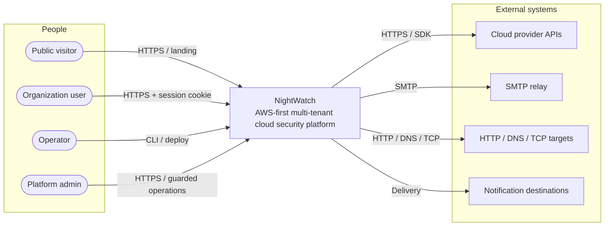

# Architecture Blueprint

NightWatch is an AWS-first, multi-tenant cloud security platform. This document defines its software and solution architecture: C4 levels 1 through 3, data architecture, deployment topology, operational boundaries, and conformance rules. Code, tests, and scripts own implementation details.

## 0. Scope and conventions

Out of scope:

- Product Direction, user problems, and product scope → `docs/product-direction.md`
- Functional requirements, user flows, business roles/actions, admission policy, and acceptance criteria → Feature/Story/API contracts
- API endpoint behavior: endpoint names, exact response codes, and response schemas for each feature → API contracts; `packages/api-contract` is an integration boundary, not the source of feature behavior
- UX/UI → `docs/design-system.md`
- Delivery workflow (assignment, candidate, validation gates) → planning artifacts and agent contracts
- Verification commands, toolchain, and environment (`package.json`, `turbo.json`, CI, `scripts/quality/README.md`)

Conventions:

- Reference rules by ID, such as `TSQL-01`, in assignments, findings, reviews, and decisions. IDs MUST remain stable. Append new rules. MUST NOT renumber rules or reuse IDs. Removed IDs remain unavailable.
- Each rule contains one primary requirement plus necessary conditions and exceptions. Separately testable requirements require separate IDs. `Never` and `MUST NOT` indicate prohibitions.
- Values marked `baseline` are design defaults only for components with `Planned` or `Deferred` status. Once a component is `Implemented`, code owns tuning values, while this document retains only the rules governing them.
- Status labels: `Implemented` (code exists), `Planned` (design is defined; code is pending), `Deferred` (deferral is approved; design is defined but code does not exist). Status applies only to the specified component or contract. It does not propagate to every capability, table, or workflow in that container. `Implemented` does not mean verified or release-ready. A capability without an explicit status MUST NOT be assumed implemented.
- If code conflicts with this document, report the conflict to the Technical Lead as a finding. MUST NOT change either side without reporting it.

Terminology: tenant = organization; `tenantId` = organization id

Rule ownership:

| Category                     | Owns                                                                                                                                                                                                         |
| ---------------------------- | ------------------------------------------------------------------------------------------------------------------------------------------------------------------------------------------------------------ |
| 1. Architecture drivers      | Architectural qualities and principles that impose design constraints                                                                                                                                        |
| 2. System context            | Actors, external systems, and trust boundaries (CTX)                                                                                                                                                         |
| 3. Container architecture    | Containers, package dependency direction (CON, PKG), and container responsibilities                                                                                                                          |
| 4. Component architecture    | API pipeline (REQ), identity boundary (AUTH), tenant context (ORG), background execution (QUE), SPA integration (FE), outbound and cross-cutting contracts (XC-01, XC-02, XC-05, XC-06, XC-09 through XC-11) |
| 5. Data architecture         | Logical persistence model, tenant SQL/RLS (TSQL), persistence lifecycle (DATA), and encryption at rest (XC-04)                                                                                               |
| 6. Deployment and operations | Runtime topology (DEP), observability and audit (XC-03, XC-07, XC-08), and production authorization                                                                                                          |
| 7. Conformance checklist     | Checks against canonical architecture rules only                                                                                                                                                             |

## 1. Architecture drivers and principles

These drivers are design constraints, not product targets. Numeric SLOs belong in their owning contracts. Values marked `baseline` follow the rules in §0.

- Security and tenant isolation: PostgreSQL enforces tenant isolation through RLS and non-owner runtime roles. Every request uses one verified tenant context throughout its path. Trust boundaries are defined in §2.
- Reliability: no state exists only in transport. Background work is durable in SQL. SQL commits before enqueue, with compensation and recovery.
- Integrity: SQL enforces invariants through constraints, uniqueness, claims, and CAS rather than code alone. Writes are idempotent. Work that requires reconciliation has a ledger.
- Maintainability: one modular monolith with a clear, enforced package dependency direction. Premature abstractions are prohibited.
- Operability: observability, including structured logs, audit, health, and readiness, is part of the architecture. Migrations and partition maintenance are bounded deployment steps.
- Performance and scalability: network and CPU work stays outside SQL transactions. Batch size and concurrency are bounded per worker instance. Time-growing tables use pre-created partitions.
- Privacy and compliance: protected data is encrypted at rest. Logs and audit records MUST NOT contain secrets or personal data. Legal requirements such as GDPR are policy decisions outside this document.
- Accessibility boundary: the design system owns UX/UI. Architecture retains one invariant: authorization and business logic MUST NOT depend on UI helpers (FE-07).
- Cost: cost-related architecture constraints include independently deployed static builds, Redis as transport only, reports stored in the database instead of object storage, and a modular monolith instead of distributed services. Budgets and pricing are outside this document.

## 2. System context (C4 level 1)



Actors: public visitor; organization user, whose business roles are defined outside this document; operator; platform admin. External systems: cloud provider accounts, primarily AWS plus GCP; SMTP relay; notification destinations; and monitored HTTP/DNS/TCP endpoints. Provider support follows an AWS-first design.

- CTX-01 Authentication data, session cookies, and internal data MUST NOT be sent to the landing site.
- CTX-02 Organization users MUST access data only through the Web SPA → API path using a session cookie. No other client path is allowed.
- CTX-04 Platform-admin access MUST have an explicit guard for each operation. It MUST NOT act as a global tenant-context bypass.
- CTX-05 Outbound integrations, including cloud APIs, SMTP, destinations, and monitors, MUST originate only from the API or Worker and remain within the outbound integration boundary in §4.6 (XC-05, XC-09 through XC-11).
- CTX-06 The owner connection is a privileged path for DDL, migrations, partition maintenance, and other approved owner operations outside the HTTP request path. This document does not authorize other uses of the owner connection. Runtime roles MUST NOT hold owner privileges (TSQL-03).

## 3. Container architecture (C4 level 2)

```text
C4 Level 2 — NightWatch containers

Entry points
[Public visitor]     --HTTPS--------------------> [Landing | Astro | Deferred]
[Organization user] --HTTPS--------------------> [Web SPA | React + Vite | Implemented]
[Platform admin]    --guarded HTTPS------------> [API | Hono on Bun | Implemented]
[Operator]          --owner connection---------> [PostgreSQL | Drizzle + RLS | Implemented]

Request and background paths
[Web SPA] --JSON/HTTPS + session cookie--> [API] --tenant SQL--> [PostgreSQL]
                                               |
                                               +--typed jobs--> [Redis/BullMQ | Deferred]
                                                                    |
                                                                    +--consume--> [Worker | Deferred]
                                                                                     |
                                                                                     +--tenant SQL--> [PostgreSQL]

Outbound paths
[API]    --HTTPS / SMTP----------------------> [External integrations]
[Worker] --SDK / HTTP / DNS / TCP / SMTP----> [External integrations]

[Landing] has no internal dependencies. Redis is transport only.
```

| Container    | Technology                    | Status      | Location         |
| ------------ | ----------------------------- | ----------- | ---------------- |
| Web SPA      | React, Vite                   | Implemented | `apps/web`       |
| API          | Hono monolith on Bun          | Implemented | `apps/api`       |
| PostgreSQL   | Drizzle, migrations, RLS      | Implemented | `packages/db`    |
| Worker       | BullMQ consumers, schedulers  | Deferred    | `apps/worker`    |
| Redis/BullMQ | Job transport                 | Deferred    | `packages/queue` |
| Landing      | Astro, independently deployed | Deferred    | `apps/landing`   |

- CON-01 PostgreSQL is the system of record. Redis is transport only. State MUST NOT exist only in Redis (DATA-02).
- CON-02 The API MUST remain one modular monolith with domain modules under `apps/api/src/<domain>`. It MUST NOT be split into services, use a DI container, or add a speculative repository layer.
- CON-03 The Worker MUST NOT couple to the API over HTTP. They share code only through packages.
- CON-04 The landing site MUST NOT have a `workspace:*` dependency or application API client. Its authentication boundary follows CTX-01.
- CON-05 The Web SPA MUST preserve the browser-safe boundary defined by package dependency contract PKG-01 and the external database/queue client prohibition in PKG-05.
- CON-06 SQL commit and Redis enqueue are not jointly atomic. Code MUST commit first, enqueue second, and compensate on failure (QUE-09).

### 3.1 Code packages and dependency direction

- `packages/api-contract`: browser-safe Zod schemas, types, and error contract. Exports MUST come only from the package root.
- `packages/db`: Drizzle schema and client, tenant helpers, ordered migrations, and partitions. Server-side only.
- `packages/queue` (Deferred): job payloads, options, producers, and the SQL `queue_jobs` ledger. Server-side only; may depend on `db`.
- `packages/shared`: permissions, limits, encryption, logging, SSRF, and email configuration. Server-side only; MUST NOT import from an app.
- `packages/*-config`: compiler and lint configuration. MUST NOT contain runtime code or import from an app.
- PKG-01 Runtime imports between workspace packages MUST follow this table. The table does not cover external libraries. Dev-time compiler and lint configuration is separate from the runtime graph, and config packages themselves MUST have no workspace dependencies. This table is not a list of all implemented imports.

  | Importer        | Allowed workspace runtime dependencies                             | Current boundary / target                                                                 |
  | --------------- | ------------------------------------------------------------------ | ----------------------------------------------------------------------------------------- |
  | Web SPA         | `api-contract`                                                     | Current boundary                                                                          |
  | API             | `api-contract`, `shared`, `db`; `queue` when producers are enabled | The first three are current dependencies; `queue` is a Deferred target                    |
  | Worker          | `queue`, `db`, `shared`                                            | Deferred target for consumers, SQL, and shared integration helpers                        |
  | `queue`         | `db`                                                               | Deferred target for the ledger                                                            |
  | `shared`        | No workspace runtime dependency                                    | Current boundary; MUST NOT import an app                                                  |
  | `db`            | No workspace runtime dependency                                    | Current boundary                                                                          |
  | `api-contract`  | No workspace runtime dependency                                    | Current browser-safe boundary                                                             |
  | Landing         | No workspace dependency                                            | Deferred target under CON-04                                                              |
  | Config packages | No workspace dependencies                                          | MUST NOT import app/runtime code; external compiler/lint libraries are outside this graph |

- PKG-02 Import-boundary lint enforcement for PKG-01 MUST remain in place. Rules MUST NOT be weakened or disabled to pass checks. Report any enforcement gap as a review finding with its source and evidence. A gap does not justify weakening the requirement.
- PKG-03 Circular imports are prohibited. Functions MUST be composed with explicit inputs.
- PKG-04 Domain modules use `routes.ts` for HTTP and context, `schemas.ts` for inputs, and `service.ts` for transport-independent logic. The API MUST NOT import frontend code.
- PKG-05 The Web SPA MUST NOT import PostgreSQL or Redis clients.

### 3.2 Container responsibilities

The table assigns responsibilities and interfaces, not execution order. Component rules are in §4; data rules are in §5.

| Component                     | Responsibilities / interfaces                                           | Contract and status boundary                                         |
| ----------------------------- | ----------------------------------------------------------------------- | -------------------------------------------------------------------- |
| API domain modules            | Routes accept HTTP; services accept typed inputs; schemas define inputs | PKG-04, REQ rules; does not claim every domain is implemented        |
| Identity / session boundary   | Integration with the identity library in `apps/api/src/auth`            | AUTH-08 through AUTH-12; Implemented                                 |
| Tenant context / organization | Tenant context and membership resolution in `apps/api/src/me`           | ORG rules; Implemented                                               |
| Tenant data access            | Drizzle/raw SQL helpers in `packages/db`                                | TSQL rules; helper status is defined separately in data architecture |
| Worker consumers / schedulers | Consume jobs, find due work, and call provider/monitor integrations     | QUE rules; Deferred                                                  |
| Web API integration           | Typed clients, response validation, and tenant-sensitive state          | FE rules                                                             |

## 4. Component architecture (C4 level 3)

### 4.1 API pipeline and tenant context

```text
Request
  -> request context, logs, metrics
  -> rate limiter
  -> credentialed CORS (exact origin)
  -> tenant middleware: session -> verified membership
                        -> tenantId, userId, userRole
  -> permission guard -> Zod parsing
  -> service(tenantId, ...)
  -> tenant transaction: scoped checks -> change -> COMMIT
  -> enqueue + audit -> response
```

- REQ-01 The same organization scope MUST be used across URL `orgId`, service `tenantId`, SQL context, and job payloads.
- REQ-02 Before implementation, every route MUST be classified as tenant-protected, pre-tenant, or narrowly scoped platform access.
- REQ-03 Tenant context MUST be resolved server-side only from authenticated identity and verified current membership (Planned). Values from requests, including URL paths, headers, and bodies, and browser-selected values are untrusted hints. API contracts own source precedence.
- REQ-04 Membership MUST be verified before any data access.
- REQ-05 Application routes MUST reject missing or invalid sessions before accessing tenant data. They MUST reject invalid membership or permission using the `api-contract` error envelope. API contracts own exact response codes. Rejections MUST be audited without recording protected data.
- REQ-06 Each operation MUST have an explicit permission guard. Feature/API contracts own each permission’s name and business meaning.
- REQ-07 Routes own HTTP input and output conversion. Services accept `tenantId` and typed inputs and MUST remain transport-independent.
- REQ-08 Network and CPU work MUST remain outside SQL transactions.
- XC-01 Input validation MUST use Zod schemas from `api-contract` and shared validators from `shared`.
- XC-02 Errors: `AppError(status, code, message, details?)` → `{ error: { code, message, details? } }`. The first argument MUST be status. The code-first overload MUST NOT be reintroduced. Production-like environments MUST present unknown errors generically.
- XC-12 Application request-validation failures MUST use the canonical error envelope (`api-contract`). This includes failures from framework validation hooks before handlers. Responses MUST NOT expose raw Zod issues, submitted input, credentials, tokens, or stack traces.
- XC-06 Rate limiting MUST use a Redis sliding window separate from auth throttling, with a bounded limiter timeout (baseline 2 s). Limiter errors MUST be tested. Fail-closed behavior MUST NOT be assumed.

### 4.2 Identity and session integration boundary

Identity uses Better Auth with PostgreSQL/Drizzle and includes users, sessions, provider accounts, verifications, memberships, invitations, and TOTP two-factor entities. The library version is pinned in `apps/api/package.json`. Feature/Story contracts own identity admission, business authorization, and MFA enforcement policy. This document defines only the integration boundary that remains subject to those policies.

- AUTH-08 `auth.getSession(headers)` MUST be the only session entry point for application code.
- AUTH-09 Session cookies MUST be host-only, `HttpOnly`, `SameSite=Lax`, and `Secure` in production. Cookie scope MUST NOT be widened to support CORS.
- AUTH-10 `CORS_ORIGIN`, `APP_URL`, and `trustedOrigins` MUST be consistent. Credentialed CORS with an exact origin MUST run before the auth handler.
- AUTH-11 Raw identity-library endpoints MUST return the library's error shape. Application routes MUST use the `api-contract` envelope (XC-02).
- AUTH-12 Auth usage MUST remain within the CTX-01 landing boundary and XC-07 logging exclusions, with no auth-specific exceptions.
- AUTH-13 Post-authentication and return destinations are untrusted input. Canonicalization MUST yield same-origin absolute paths. It MUST occur before persistence and redirects, and on browser-storage reads. Protocol-relative paths and external origins MUST fall back to `/workspace`. Paths with literal or percent-encoded backslashes MUST also fall back. The same applies to literal or percent-encoded control characters.

### 4.3 Tenant context and organization access

Implemented in `apps/api/src/me`. API contracts own endpoint names and response codes.

- ORG-02 Membership lookup MUST use a pre-tenant parameterized query scoped by the current identity, using the user id from the verified session. Responses MUST NOT reveal organizations the user does not belong to.
- ORG-03 Remembered or denormalized tenant ids, such as `last_active_tenant_id`, are hints. They MUST be revalidated against current membership before every use.
- ORG-04 Changing tenant context MUST revalidate membership within the same transaction and atomically update dependent auth context, such as a session mirror. Values mirrored into a session MUST NOT be used as membership evidence.
- ORG-05 Denied tenant-context access MUST be audited without recording tenant data or other protected data.
- ORG-10 Tenant-context exchange MUST use contract schemas from `api-contract` and reference only authenticated sessions. API contracts own each endpoint’s response behavior.

### 4.4 Background execution architecture (Deferred)

Queue names, concurrency, and attempts define execution channels, not business behavior.

| Queue               | Responsibility                                                      | Conc. | Attempts |
| ------------------- | ------------------------------------------------------------------- | ----: | -------: |
| `scan-orchestrate`  | Plan tasks and distribute work                                      |     2 |        3 |
| `scan-collect`      | Collect data with Prowler                                           |     3 |        3 |
| `rule-evaluate`     | Evaluate findings and request notification through `notify-deliver` |     5 |        3 |
| `report-generate`   | Generate report artifacts                                           |     2 |        3 |
| `health-collect`    | Collect AWS infrastructure health                                   |     5 |        3 |
| `notify-deliver`    | Deliver notifications and record each attempt's result              |    10 |        3 |
| `prowler-rule-sync` | Maintain the shared provider rule catalog                           |     1 |        1 |
| `health-check`      | Run synthetic monitoring                                            |    10 |        3 |
| `slo-recalculate`   | Maintain service objectives                                         |     5 |        3 |

- QUE-01 Concurrency and attempts are baselines per worker instance. Use exponential backoff starting at 5 s. Value precedence is per-queue override → worker default → built-in value. `prowler-rule-sync` accepts only an override explicitly assigned to that queue. It MUST NOT use a global override.
- QUE-02 Concurrency 1 is not a distributed singleton. Singleton behavior MUST be enforced in SQL.
- QUE-03 Every job MUST include `tenantId`. Shared-catalog jobs require separate authorization through `requestedByTenantId`. Payload identity MUST NOT be used as SQL context (TSQL-01).
- QUE-04 Retryable, delayed, and exhausted states MUST be distinct. Ledger reconciliation MUST track failures between enqueue and ledger recording.
- QUE-05 Delivery work for notification destinations MUST be scoped by tenant and Project. Every attempt result MUST be stored durably in SQL. Delivery MUST be idempotent: successful deliveries MUST NOT be repeated, but bookkeeping writes may be retried. Feature contracts own channel selection and routing behavior.
- QUE-06 The Prowler version MUST remain pinned until an approved and compatibility-tested change.
- QUE-07 Security collection through Prowler, health collection through AWS SDK, and monitoring through HTTP/DNS/TCP MUST remain separate.
- QUE-08 Integration imports and credentials MUST remain separate from live OAuth sync.
- QUE-09 Enqueued work MUST always reference committed SQL state (CON-06). If enqueue failure is reported, compensation MUST update SQL state with an error summary.
- QUE-10 The scheduler MUST poll at a fixed interval with a bounded batch size (baseline every 60 s, batches of 10). It MUST claim due work with `FOR UPDATE SKIP LOCKED`, commit before enqueue, and compensate on enqueue failure.
- QUE-11 Job identity MUST be deduplicated with BullMQ `jobId`. The job name MUST NOT be used. Payloads MUST include a snapshot of scope and configuration at enqueue time.
- QUE-12 Integrations that run as child processes, such as Prowler, MUST use argument arrays, a bounded timeout (baseline 10 min), and a temporary output directory. Exit codes and exceptions MUST be classified as retryable or terminal consistently with SQL state.
- QUE-13 Temporary credential files MUST use mode `0600` and be deleted in `finally`. Decrypted credentials MUST NOT appear in jobs or ledger summaries.
- QUE-14 Dispatch MUST claim pending work atomically with a guarded marker update. It MUST commit the complete dispatch total before the first enqueue. Recovery MUST cover both claimed-but-not-enqueued work and partially enqueued batches.
- QUE-15 Consumer writes MUST be idempotent through a uniqueness key stable for the work's business identity and an upsert on the current-state key. Retries between separately committed writes MUST be supported.
- QUE-16 Finalization MUST select one finalizer with CAS (`UPDATE ... WHERE status = 'running' RETURNING id`). Duplicate terminal events and child-work retries MUST be safe.
- QUE-17 Post-processing after terminal status is independent of terminal status. Terminal status does not confirm successful notification, reconciliation, or aggregation. Failures and recovery for those tasks MUST be exposed separately.
- QUE-18 The sweeper MUST mark inactive work as failed after the configured inactivity period (baseline sweep every 5 min, inactivity 30 min), after comparing counters with waiting, active, and delayed jobs. Counter repair is not exactly-once recovery.

### 4.5 Web SPA integration architecture

- FE-01 The typed client in `apps/web/src/lib/api` MUST call `/api` with credentials. It MUST handle JSON, empty no-content responses, and non-OK responses. The real API composition MUST produce the OpenAPI source. Every operation's path, method, and path-parameter types MUST derive from it. Every operation's request-body and successful-response types MUST also derive from it. These types MUST NOT be handwritten.
- FE-02 Responses MUST be validated at runtime with schemas from `api-contract`. TypeScript generics do not validate data. `ApiError` exposes server `error.code` and `details` only when explicitly mapped. Each operation's runtime schema MUST be statically compatible with its generated success type.
- FE-05 Query keys MUST include `organizationId`, `projectId`, filters, and selected ids. Inflight responses MUST NOT populate another tenant’s view. Each QueryClient MUST be scoped by resolved authentication identity.
- FE-06 Active work status refresh uses polling, not WebSocket or SSE. Polling cadence is a code tuning value, not an architecture rule.
- FE-07 Role helpers and router helpers are for UX only. Authorization belongs in the API.
- FE-08 UI structure, tokens, and accessibility MUST follow `docs/design-system.md`, which owns UX/UI.
- FE-09 A browser-selected tenant value is only a UX hint. The client MUST NOT trust a selected or request-supplied value without server verification (REQ-03).
- FE-10 The client MUST replace the tenant boundary only after the server confirms the context change. State bound to the previous tenant MUST be invalidated, and inflight results MUST be prevented from crossing into the new context.
- FE-11 Data loaders and their rendered trees MUST share the QueryClient for the same resolved identity. A loader/session identity mismatch MUST stop before query prefetch or route commit.
- FE-12 Protected data routes MUST prefetch their primary query before route commit. Loader redirects and prefetching are UX only. The API MUST enforce authentication, authorization, and membership (FE-07).

### 4.6 Outbound integration boundary

- XC-05 Every outbound HTTP(S) call MUST use the shared SSRF helper, covering embedded credentials, blocked headers, private addresses, redirects, DNS changes, and connection-time behavior.
- XC-09 Mail MUST use a real SMTP transport with `verify()` at startup. No environment may fall back to a fake transport.
- XC-10 Outbound integrations MUST use shared helpers according to the protocol applicability below. This requirement preserves the CTX-05 boundary. It does not imply that the HTTP(S) helper supports every protocol. HTTP(S) validation MUST NOT be treated as evidence for another protocol. A protocol without detailed rules is not exempt.
- XC-11 Integration credentials MUST be encrypted at rest under XC-04. Decryption MUST remain within a narrow boundary, using credential helpers or temporary files under QUE-13. Decrypted credentials MUST NOT enter job payloads or the ledger.

Protocol applicability:

| Protocol / integration                                                  | Applicable contract                                                                                                                             | Status                           |
| ----------------------------------------------------------------------- | ----------------------------------------------------------------------------------------------------------------------------------------------- | -------------------------------- |
| HTTP(S), including cloud API and notification-destination HTTP(S) calls | XC-05 for outbound safety; XC-04 for credential encryption; QUE-13 for credential handling                                                      | Current                          |
| Cloud SDK, primarily AWS plus GCP                                       | CTX-05, XC-10, XC-11; collector separation under QUE-07                                                                                         | Current/Deferred per integration |
| DNS/TCP synthetic monitoring                                            | CTX-05, XC-10, and collector separation under QUE-07; destination validation and connection-time behavior MUST be defined before implementation | Deferred                         |
| SMTP                                                                    | XC-09 for transport/startup verification; XC-04 and XC-11 for credentials; the SMTP SSRF-helper boundary MUST be defined before implementation  | Current/Deferred                 |

## 5. Data architecture

### 5.1 Logical persistence model

The diagram is a logical target, not a list of implemented physical tables. PostgreSQL and `packages/db` being `Implemented` does not make every entity current. Auth persistence in the identity boundary is current. The status and coverage of every other entity are determined by its related capability; names alone do not imply implementation.

```text
organizations (= tenants) -- memberships(role) -- users
  -- sessions / accounts / MFA
  +-- teams -- team_memberships
  +-- projects -- project_cloud_accounts / project_frameworks
  +-- frameworks -- framework_mappings -- rules
  +-- scan_schedules -- scans -- scan_tasks
  +-- finding_occurrences -> finding_current -> daily aggregates
  +-- resources_current -- resource_edges
  +-- services -- owners / dependencies
  +-- monitors -- targets / runs -- service_objectives
  +-- reports / org_credentials
  +-- notification_destinations -- notification_deliveries
  +-- employees / service_integrations
  +-- audit_events / queue_jobs
```

### 5.2 Tenant SQL and RLS (load-bearing)

| Caller          | Helper                                      | Status      |
| --------------- | ------------------------------------------- | ----------- |
| Drizzle queries | `withTenantContext(tenantId, tx => ...)`    | Implemented |
| API raw SQL     | `withTenantContextRaw(tenantId, tx => ...)` | Implemented |
| Worker raw SQL  | `withWorkerTenantContext(tenantId, ...)`    | Deferred    |

- TSQL-01 The tenant helper MUST open a transaction and set `app.tenant_id` with transaction-local `set_config(..., true)`. Every query, including `tx.unsafe`, MUST use the provided `tx`. Global or pooled handles MUST NOT be used.
- TSQL-02 All query values MUST be bound.
- TSQL-03 Runtime roles MUST be non-owner and `NOBYPASSRLS`. Runtime MUST NOT have superuser privileges. TSQL-12 governs owner access separately.
- TSQL-04 Domain tables with `tenant_id` MUST have table-specific `USING` and `WITH CHECK` policies, restrictive context guards, and `FORCE ROW LEVEL SECURITY`.
- TSQL-05 Shared-catalog rows where `tenant_id IS NULL` may be read only with a valid tenant context. Tenant contexts MUST NOT write those rows.
- TSQL-06 Pre-tenant limitation: global auth tables (`user`, `session`, `account`, `verification`, `organization`, `member`, `invitation`, `twoFactor`) are not tenant-scoped by RLS because login and membership resolution run before tenant context exists, and users may belong to multiple organizations. Isolation for these tables depends on verified membership lookups and organization-bound auth queries. It MUST NOT depend on `app.tenant_id`.
- TSQL-07 The runtime role MUST receive only the DML grants required on auth tables through migrations and remain non-owner so RLS applies when domain tables are added.
- TSQL-08 The intended database role MUST be reviewed for every pre-tenant lookup, scheduler discovery, cross-tenant maintenance, and ledger access path.
- TSQL-09 Tenant and Project predicates MUST be explicit according to data scope, in addition to RLS.
- TSQL-10 Identifiers, sort columns, and sort directions MUST use allow-lists.
- TSQL-11 Parent scope MUST be verified. Foreign keys alone are insufficient.
- TSQL-12 The owner role is reserved for DDL, migrations, and partition maintenance over the owner connection. This document does not authorize other uses of the owner connection; authorization must come from the owning document. HTTP handlers and DML workers MUST NOT hold owner privileges.

### 5.3 Persistence lifecycle and integrity

- DATA-01 User ids use text. Organization and Project ids use UUID. Feature/API contracts own business roles. Tenant-safe relationships MUST be enforced, and `last_active_tenant_id` MUST have a current valid membership.
- DATA-02 Schedules, task and evaluation totals and results, cancellations, effective rulesets, and dispatch claims MUST be stored in SQL. They MUST NOT exist only as Redis progress.
- DATA-03 Monthly occurrence history, current findings, and daily summaries MUST use separate tables. This is not event sourcing.
- DATA-04 `audit_events` and `queue_jobs` are operational records, not business state. The ledger is not a queue engine.
- DATA-05 Generated report artifacts MUST be stored in `reports.content`, not object storage. Data MUST be read in a tenant transaction, serialized outside the transaction, and then stored in a scoped transaction.
- DATA-06 Migrations are ordered `NNNN_*.sql` files run by a custom runner using `__nightwatch_migrations` for status, advisory locking, and one transaction per migration. `drizzle-kit push` and `migrate` MUST NOT be used. Applied migrations MUST NOT be rewritten. Generated SQL MUST be reviewed against the applied migration sequence.
- DATA-07 Each migration MUST include constraints, RLS policies, grants, and partitions within its scope.
- DATA-08 Monthly partitions for `audit_events`, `monitor_runs`, and `finding_occurrences` MUST be created 12 months in advance by scheduled DDL under the owner role. They MUST NOT be created during requests or by a DML worker.
- DATA-09 Employee data and provider inventory MUST remain separate from login accounts.
- DATA-10 The migration runner MUST resolve `DATABASE_OWNER_URL` before `DATABASE_URL`. TSQL-03 and TSQL-12 define the database-role boundary.
- XC-04 Encryption at rest: AES-256-GCM, random 12-byte IV, 16-byte tag, and a 32-byte base64url key. One key is active; old keys remain available with versions. This is not KMS envelope encryption.

## 6. Deployment and operations

```text
Web SPA, Landing: independent static builds and deployments
API image:    owner-role pre-deploy migrations + partition bootstrap
              -> application-role runtime -> /health, /ready
Worker image: combined consumers + scheduler/dispatcher loops,
              or explicitly configured separate roles
PostgreSQL + Redis; owner-role monthly partition-maintenance cron
```

- DEP-01 Combined or separate worker entrypoints MUST be selected explicitly. The default entrypoint starts only the main consumers, not every role. Active consumers and schedulers MUST be verified before increasing replica count.
- DEP-02 Containers MUST run as non-root and pin runtime dependencies. Build-time and runtime environments MUST be consistent.
- DEP-03 Shutdown, interrupted or stalled jobs, and retry-safe effects MUST be tested. Complete draining MUST NOT be assumed.
- DEP-04 Partition maintenance MUST run during each deployment (DATA-08).
- DEP-05 TLS, origins, secrets, replica counts, credentials, and database privileges MUST be checked in the target environment. Use of production credentials, migrations, deployments, and releases MUST receive explicit authorization through an external approval gate outside this document.
- XC-03 Audit events MUST include request and actor context and state whether recording is transactional or best-effort. Payloads MUST NOT contain secrets or protected data.
- XC-07 Logging: production-like runtimes MUST use structured Pino logging with entrypoint-specific redaction. Logs MUST NOT contain entire jobs, credentials, provider responses containing secrets, or one-time links/tokens for authentication, recovery, or admission.
- XC-08 Health: `/health` checks liveness. `/ready` reports ready only when database `SELECT 1` succeeds and, when queues are enabled, Redis ping succeeds. Readiness does not verify RLS, partitions, SMTP, or worker operation.

## 7. Architecture conformance checklist

This checklist checks only the architecture rules in this document. It is not feature acceptance, a test plan, or a verification procedure. Every item cites a rule defined here and adds no policy. Mark an item complete only with evidence accepted by the Technical Lead.

### 7.1 Security and tenant isolation

- [ ] Routes are classified as tenant-protected, pre-tenant, or platform access (REQ-02)
- [ ] Membership is verified before data access, and client-supplied tenant values are not trusted without verification (REQ-03, REQ-04, FE-09)
- [ ] Return destinations are canonical before persistence and redirects, and on storage reads. Unsafe values fall back safely (AUTH-13)
- [ ] Every operation has an explicit permission guard, and platform access is limited to that operation (REQ-06, CTX-04)
- [ ] Tenant SQL uses the helper and provided `tx`; values are bound, and predicates, identifiers, and parent scope follow their owning rules (TSQL-01, TSQL-02, TSQL-09, TSQL-10, TSQL-11)
- [ ] Migrations for new domain tables include RLS policies, FORCE RLS, and complete runtime grants (TSQL-04, DATA-07)
- [ ] Tenant context is resolved server-side from authenticated identity and verified current membership (REQ-03, REQ-04, ORG-02)
- [ ] Remembered or denormalized tenant values, including session mirrors, are revalidated every time and are not authorization evidence (ORG-03, ORG-04)
- [ ] Tenant-context changes revalidate membership and atomically update dependent auth context (ORG-04)
- [ ] Change identity or tenant only after server confirmation. Stop loader/session identity mismatches before prefetch or route commit. Invalidate old state. Prevent inflight results from crossing contexts (FE-05, FE-09, FE-10, FE-11)
- [ ] Logs, jobs, ledger entries, and audit payloads contain no secrets or one-time links/tokens (XC-07, XC-03, QUE-13)
- [ ] Outbound calls use SSRF helpers according to protocol applicability (XC-05, XC-10)

### 7.2 Data integrity and concurrency

- [ ] SQL enforces invariants through unique indexes, claims, and CAS rather than code alone (QUE-02, QUE-14, QUE-15, QUE-16)
- [ ] SQL commits before enqueue, with compensation (CON-06, QUE-09)
- [ ] Writes are idempotent, and totals are retry-safe (QUE-14, QUE-15, QUE-05)
- [ ] Migrations are ordered, and applied migrations are not overwritten (DATA-06)

### 7.3 Reliability and recovery

- [ ] Retryable, delayed, exhausted, and terminal states are distinct (QUE-04, QUE-12)
- [ ] Recovery covers partial failures, including claim-before-enqueue, partial batches, and stalled jobs (QUE-14, QUE-18)
- [ ] Work after terminal status reports its own failures (QUE-17)
- [ ] Shutdown and interrupted-job cases have been tested (DEP-03)

### 7.4 Observability and audit

- [ ] Every entrypoint uses structured logs with redaction (XC-07)
- [ ] Security-relevant events and denials are audited without protected data (REQ-05, ORG-05, XC-03)
- [ ] Health and readiness reflect actual dependencies and the limits of those checks (XC-08)
- [ ] Ledger and reconciliation failures are observable (QUE-04)

### 7.5 Performance and scalability

- [ ] Network and CPU work remains outside SQL transactions (REQ-08)
- [ ] Batch and concurrency limits are explicit and defined per instance (QUE-01, QUE-10)
- [ ] Isolate QueryClients by resolved identity. Isolate query keys and caches by tenant and Project (FE-05, FE-11)
- [ ] Partitioned tables have pre-created partitions (DATA-08)

### 7.6 Maintainability and boundaries

- [ ] Dependency direction and package layout are followed, including enforcement coverage checks (PKG-01, PKG-02, PKG-03, PKG-04, PKG-05)
- [ ] Generate client operation types from current OpenAPI. Validate responses with compatible `api-contract` schemas (FE-01, FE-02)
- [ ] Application/framework request-validation failures use the canonical error envelope. They do not expose validation internals or submitted input (XC-01, XC-02, XC-12)
- [ ] There is no service split, DI container, speculative repository layer, or circular import (CON-02, PKG-03)
- [ ] Prowler and runtime dependency versions are pinned (QUE-06, DEP-02)

### 7.7 Privacy and data protection

- [ ] Credentials are encrypted at rest with versioned keys (XC-04)
- [ ] Temporary credential files use mode 0600 and are deleted after use (QUE-13)
- [ ] Logs and audit payloads contain no personal data or secrets (XC-07, XC-03)
- [ ] Landing receives no authentication or internal data (CTX-01, CON-04)

### 7.8 Operability and deployability

- [ ] Owner and runtime roles are separated under TSQL-12; migrations use the owner connection before application runtime (TSQL-03, TSQL-12, DATA-10)
- [ ] Worker entrypoint roles are selected explicitly before scaling (DEP-01)
- [ ] TLS, origins, secrets, and privileges are checked in the target environment (DEP-05)
- [ ] SMTP is verified at startup, with no fake transport (XC-09)
- [ ] Authorization does not depend on UI helpers (FE-07)
