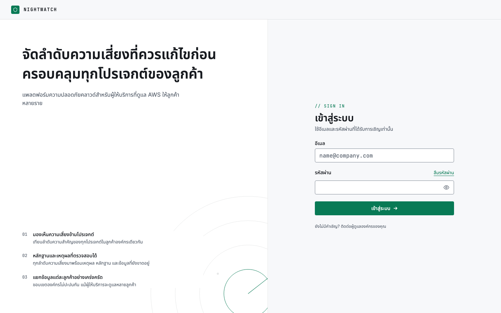
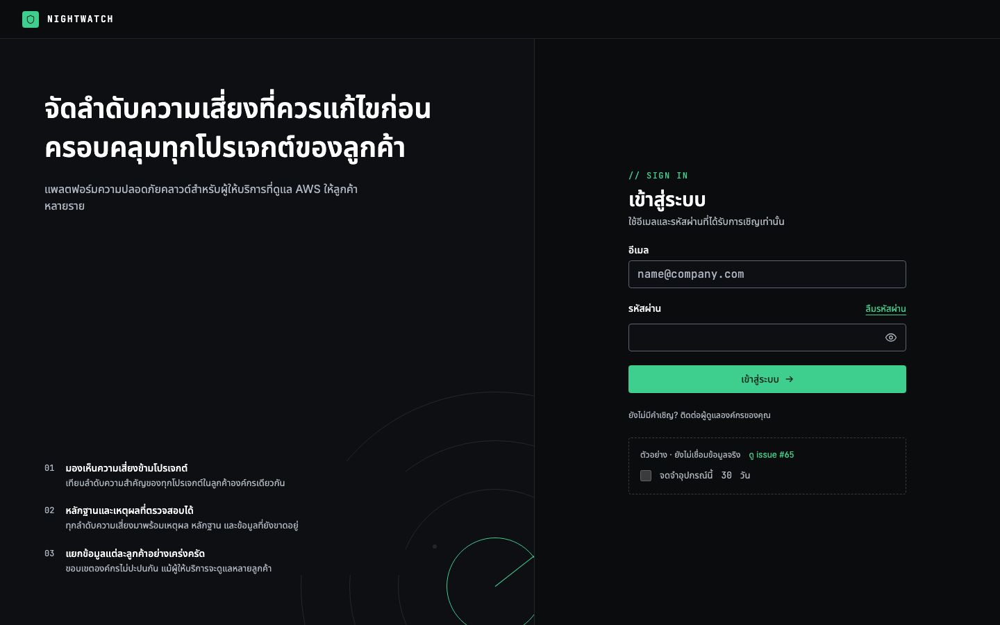
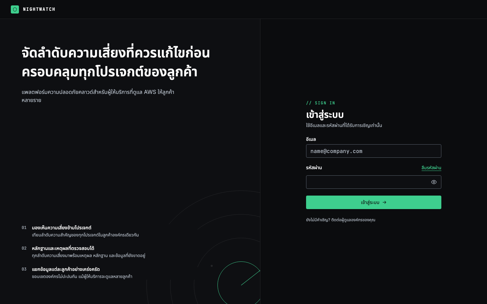

# Issue #65 Screenshot Evidence

- Route: `/login`
- Browser: Playwright Chromium
- Viewport: `1440×900`, device scale factor `1`
- Before: `db99a109a5dfb5ed7226ed89b336f78d3668e936`
- After: `392912867d40cd73d066d0b012c81f3d1056a5d4`
- Theme: ตั้ง `nightwatch-theme` เป็น `light` หรือ `dark` ก่อนโหลดหน้า
- Session: intercept เฉพาะ `/api/auth/get-session` ให้ตอบ `null` เพื่อแสดงหน้า anonymous, ไม่ได้ทดสอบการ login หรืออายุ cookie ด้วยภาพนี้
- Source: Before ใช้ snapshot จาก `git archive`, After ใช้ codebase ของ PR; ไม่แก้ DOM หรือ source ของหน้า login เพื่อถ่ายภาพ
- Capture: รอ fonts โหลดเสร็จและตรวจว่าไม่มี page errors

## Light

### Before

### After

## Dark

### Before

### After

## Result

`observed pass`: ทั้งสอง theme แสดง mockup checkbox 30 วันใน Before และไม่มี checkbox, mockup notice หรือลิงก์ #65 ใน After ฟอร์มอีเมล/รหัสผ่าน, ปุ่มเข้าสู่ระบบ, ลิงก์ลืมรหัสผ่าน และข้อความติดต่อผู้ดูแลองค์กรยังแสดงอยู่
