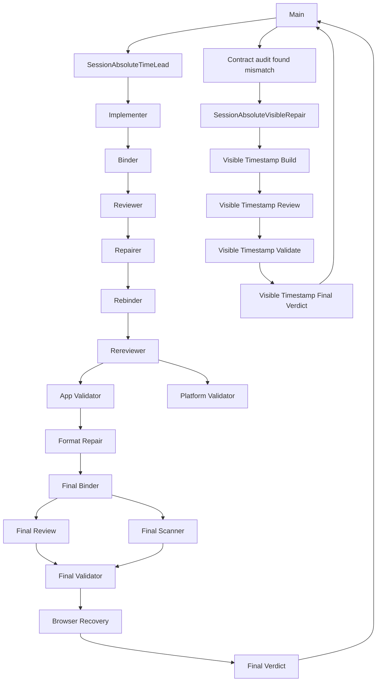

# Session Absolute Time Workflow Report

วันที่จัดทำ: 2026-09-12
ประเภท: Engineering workflow postmortem
ขอบเขต: การแก้ Session time ให้แสดง absolute time ตามแบบเข้าถึงได้ใน `apps/web`

> เอกสารนี้สรุป workflow และหลักฐานของ session การทำงาน ไม่ใช่ Product Direction, Feature contract หรือ release approval โดย source contract ที่มีอำนาจยังคงเป็น `CAPABILITY-MAP.md` และเอกสารอ้างอิงของ repository

## 1. Executive summary

ผลลัพธ์สุดท้ายตรงกับ source contract แล้ว:

```tsx
<time dateTime={row.updatedAt.toISOString()}>
  {formatDateTime(row.updatedAt, preferences)}
</time>
```

คุณสมบัติสุดท้าย:

- ผู้ใช้สายตาปกติเห็น absolute timestamp ที่จัดรูปแบบตาม account-display preferences
- Assistive technology ได้ absolute timestamp เดียวกันหนึ่งครั้ง
- `<time>` เก็บ exact ISO instant ผ่าน `dateTime`
- ไม่มี `aria-label` ซ้ำกับ visible text
- ไม่มี `sr-only` duplicate
- ไม่มี relative time แทน absolute time ที่ contract กำหนด
- Implementation commitแก้เฉพาะ:
  - `apps/web/src/pages/settings/SessionsPage.tsx`
  - `apps/web/src/pages/settings/SessionsPage.test.tsx`
- Code commit: `0907a11` (`fix(web): show absolute session timestamps`)
- เอกสาร postmortemนี้แยกเป็น documentation commit
- ไม่มี push

Workflow เกิดสอง attempts:

| Attempt | Nodes | ผล |
|---|---:|---|
| Attempt 1 — `SessionAbsoluteTimeLead` | 1 Technical Lead + 15 workers | **Superseded — ไม่ใช่ final success** |
| Attempt 2 — `SessionAbsoluteVisibleRepair` | 1 Technical Lead + 4 workers | **Authoritative final implementation** |
| Main | 1 | ประสานงาน ตรวจผล และเปิด corrective attempt |
| รวม | **22 nodes** | Main 1 + Technical Leads 2 + workers 19 |

ระยะเวลาของ Technical Lead runs:

- Attempt 1: 52 นาที 27 วินาที
- Attempt 2: 16 นาที 25 วินาที
- รวม: 68 นาที 52 วินาที

ปัญหาหลักของ workflow คือ task-local acceptance clause ใน Attempt 1 ระบุว่า visible relative time อาจคงเดิม ทั้งที่ `CAPABILITY-MAP.md:11,33` กำหนดให้ Sessions ใช้ absolute times ผ่าน `formatDateTime` ส่งผลให้ review และ validation หลายชั้นพิสูจน์ implementation ที่ไม่ตรง source contract และต้องถูก supersede ทั้ง attempt

Attempt 2 จึงต้องแก้ contract source และ tests กลับเป็น visible absolute time แล้วตรวจใหม่บน candidate binding คนละชุด

## 2. Authoritative contract

หลักฐานหลัก:

- `CAPABILITY-MAP.md:11`
  - `account-sessions` แสดง signed-in sessions และใช้ absolute times ผ่าน `formatDateTime`
- `CAPABILITY-MAP.md:33`
  - Sessions ใช้ `formatDateTime` จาก `account-display` สำหรับ absolute times ตั้งแต่วันแรก
- `docs/design-system.md`
  - Timestamp ต้องเคารพ locale, timezone และ hour-cycle preferences
  - ข้อมูลสำคัญต้องเข้าถึงได้โดยไม่พึ่ง hover หรือสี

การตีความที่ถูกต้อง:

| Requirement | Interpretation |
|---|---|
| Sessions use absolute times | Absolute timestamp เป็นข้อความหลักที่ผู้ใช้มองเห็นได้ |
| Use `formatDateTime` | ใช้ canonical account-display formatter ไม่สร้าง formatter ใหม่ |
| Accessible timestamp | Sighted users และ assistive technology ได้ข้อมูล absolute time เดียวกัน |
| Semantic time value | ใช้ native `<time dateTime={ISO}>` |
| Relative time | Optional เท่านั้น และห้ามแทน absolute value ที่ contract กำหนด |

## 3. Final candidate

Final code-only candidate binding หลังแก้ test-quality Nit:

- Base commit: `c882a5b9d542dd0570848ef8508184e8372cb00a`
- Manifest SHA-256: `9626263bd3064efc1a09aa401d7d04d32896b62a95c650314467310acc2d4ef2`
- Commit: `0907a11` (`fix(web): show absolute session timestamps`)

| File | SHA-256 |
|---|---|
| `apps/web/src/pages/settings/SessionsPage.tsx` | `4e42a8bb7593cea6dc4496c0967bf7a87b083a4c4b714eb554ef0adcfec6cfdd` |
| `apps/web/src/pages/settings/SessionsPage.test.tsx` | `395b6dd02e5e903100aa4f7e72161fd97da9f66002126ae0733fed62f74f9c38` |

Observed Chromium examples:

```html
<time datetime="2026-09-12T01:23:45.000Z">12 ก.ย. 2569 10:23 AM</time>
```

```html
<time datetime="2026-09-10T13:05:06.000Z">10 ก.ย. 2569 10:05 PM</time>
```

Accessibility tree:

- Current session: `time: 12 ก.ย. 2569 10:23 AM` — 1 occurrence
- Non-current session: `time: 10 ก.ย. 2569 10:05 PM` — 1 occurrence

## 4. Workflow graph



## 5. Node inventory และ lifecycle state

สถานะหลังงาน settle:

| # | Node | Role | Attempt | Final state |
|---:|---|---|---|---|
| 1 | `Main` | Coordinator | ทั้ง session | running |
| 2 | `SessionAbsoluteTimeLead` | Technical Lead | 1 | parked |
| 3 | `SessionTimeImplementer` | Writer | 1 | parked |
| 4 | `SessionTimeBinder` | Candidate binder | 1 | parked |
| 5 | `SessionTimeReviewer` | Static reviewer | 1 | parked |
| 6 | `SessionTimeRepairer` | Writer/repairer | 1 | parked |
| 7 | `SessionTimeRebinder` | Candidate binder | 1 | parked |
| 8 | `SessionTimeRereviewer` | Static reviewer | 1 | parked |
| 9 | `SessionTimeAppValidator` | Application validator | 1 | parked |
| 10 | `SessionTimePlatformValidator` | Platform/scanner validator | 1 | parked |
| 11 | `SessionTimeFormatRepair` | Formatting repairer | 1 | parked |
| 12 | `SessionTimeFinalBinder` | Candidate binder | 1 | parked |
| 13 | `SessionTimeFinalReview` | Static reviewer | 1 | parked |
| 14 | `SessionTimeFinalScanner` | Security scanner | 1 | parked |
| 15 | `SessionTimeFinalValidator` | Application/browser validator | 1 | parked |
| 16 | `SessionTimeBrowserRecovery` | Runtime recovery | 1 | parked |
| 17 | `SessionTimeFinalVerdict` | Technical verdict reviewer | 1 | parked |
| 18 | `SessionAbsoluteVisibleRepair` | Technical Lead | 2 | parked |
| 19 | `SessionVisibleTimestampBuild` | Writer | 2 | parked |
| 20 | `SessionVisibleTimestampReview` | Static reviewer | 2 | parked |
| 21 | `SessionVisibleTimestampValidate` | Independent validator | 2 | parked |
| 22 | `SessionVisibleTimestampFinal` | Technical verdict reviewer | 2 | parked |

Technical Leads 2 ตัวและ workers 19 ตัวอยู่สถานะ `parked` โดยไม่มีหลักฐาน explicit lifecycle release จึงเป็น orchestration cleanup gap แม้ source implementation จะเสร็จแล้ว

## 6. Main node

### Responsibilities

- อ่าน project memory และ orchestration/git workflow rules
- ส่ง implementation assignment ให้ Technical Lead
- ตรวจ Technical Lead report
- อ่าน source/test ที่เปลี่ยน
- รัน focused test ซ้ำ
- เปิด corrective assignment หลังพบ source-contract mismatch
- ตรวจ source/test และ focused test ของ final corrective candidate

### Correct decisions

- จำกัด scope สองไฟล์
- ห้าม commit/push
- ต้องมี actual browser/AX evidence
- ตรวจ focused test ซ้ำจาก Main: 1 file, 9 tests passed

### Failure

Main ใส่ derived acceptance clause ว่า visible relative time คงเดิมได้โดยไม่มี source รองรับ Clause นี้ขัดกับ `CAPABILITY-MAP.md:11,33` และกลายเป็น input ให้ Technical Lead, reviewer และ validators ใน Attempt 1

### Improvement

ก่อน dispatch ต้องสร้าง requirement table พร้อม `path:line`; derived assumption ต้องติดป้าย `assumption` และห้าม override repository contract

## 7. Attempt 1 — Superseded

Attempt 1 ไม่ใช่ final success แม้มี technical verdict `accepted` ในเวลานั้น เพราะ evidence pipeline พิสูจน์ implementation ที่ไม่ตรง source contract

### 7.1 `SessionAbsoluteTimeLead`

- แตกงานเป็น implementation, binding, review, repair, validation, scanning และ browser recovery
- อ่าน `CAPABILITY-MAP.md`, design system และ quality scripts
- กำหนด mutation ownership
- ประสานงานผ่าน task/hub
- ออก final technical verdict

จุดแข็ง:

- แยก writer, reviewer และ validator
- ใช้ immutable candidate hashes
- รักษา ambient changes
- แยก technical acceptance จาก release approval

จุดผิดพลาด:

- ให้ task-local visible-relative invariant มีอำนาจเหนือ source contract
- ไม่ escalate contract contradiction
- ทำให้ทั้ง DAG optimize ไปในทิศทางผิด

### 7.2 `SessionTimeImplementer`

กิจกรรม:

- อ่าน TDD, incremental implementation, code review และ frontend design skills
- อ่าน contract, accessibility checklist, source, tests และ formatter
- เพิ่ม regression และทำ RED/GREEN
- เปลี่ยน timestamp เป็น visible absolute
- เพิ่ม `aria-label` ซ้ำกับ visible text
- พยายาม browser smoke แต่ถูก redirect ไป login และไม่มี approved credentials

ผล:

- Visible absolute ใกล้ source contract
- `aria-label` เป็น semantic/accessibility defect
- Browser proof ยังไม่ครบ

บทเรียน:

- Native visible text ไม่ต้องมี redundant ARIA
- Writerไม่ควรรับภาระ full authenticated browser setup ระหว่าง mutation

### 7.3 `SessionTimeBinder`

- ตรวจ status, staged/worktree consistency และ manifest CLI
- สร้าง candidate binding แรก
- แยก `AGENTS.md` และ `apps/web/src/lib/sessions/sessions.ts` เป็น ambient exclusions

บทเรียน: ควร bind หลัง sourceผ่าน scoped formatting แล้วเพื่อลด rebind

### 7.4 `SessionTimeReviewer`

พบ Major 2 รายการ:

1. `aria-label` ซ้ำและไม่เหมาะกับ `<time>` — finding ถูกต้อง
2. Visible absolute เปลี่ยนจาก relative presentation — finding ผิดเพราะยึด task-local condition แทน source contract

ผลคือ reviewerสั่ง restore relative time และซ่อน absolute สำหรับ AT

บทเรียน: reviewerต้องตรวจ provenance ของ acceptance criteria ก่อนตรวจ candidate

### 7.5 `SessionTimeRepairer`

- ลบ `aria-label`
- Restore `ตอนนี้` และ relative time
- ซ่อน relative textจาก AT
- เพิ่ม absolute textแบบ `sr-only`
- ค้นหา relative helperผิดตำแหน่งและแจ้ง blocker
- Parentชี้ให้ inspect base revision
- Encountered 8/9 test failures ระหว่าง repair
- Debugจน focused testผ่าน 9/9

ผลคือ candidateมี:

```tsx
<time dateTime={iso}>
  <span aria-hidden="true">{relative}</span>
  <span className="sr-only">{absolute}</span>
</time>
```

โครงสร้างนี้ accessible แต่ไม่ตรง visible absolute contract

### 7.6 `SessionTimeRebinder`

- ขอ exact manifest command จาก parent
- สร้าง binding หลัง repair
- ผล: manifest `61e8b7ef...`

บทเรียน: manifest syntaxควรอยู่ใน standard task template

### 7.7 `SessionTimeRereviewer`

- ตรวจสองไฟล์ครบ
- ตรวจไม่มี redundant accessible name
- ตรวจ relative/hidden-absolute structure
- ออก `ready for validation`

ข้อผิดพลาด: ตรวจว่าปิด previous findingsแล้ว แต่ไม่ได้ย้อนตรวจ original source requirement

### 7.8 `SessionTimeAppValidator`

- ตรวจ hashes
- Focused testผ่าน
- `bun run validate` fail-fastที่ Prettier
- Failureอยู่ใน excluded pre-existing file `apps/web/src/lib/sessions/sessions.ts`

บทเรียน: app quality gates และ authenticated browser provisioningไม่ควรรวมใน nodeเดียว

### 7.9 `SessionTimePlatformValidator`

- ประเมิน scanner applicability
- รัน targeted Semgrep
- ตรวจ hashesและไม่มี mutation

บทเรียน: dedicated scanner nodeมีต้นทุนสูงสำหรับ semantic HTML/test-only change และไม่ช่วยจับ contract mismatch

### 7.10 `SessionTimeFormatRepair`

- รัน Prettier write เฉพาะ candidate files
- รัน Prettier check
- รัน focused test
- ตรวจ diff

บทเรียน: formattingควรเกิดก่อนประกาศ source-complete และก่อน binding แรก

### 7.11 `SessionTimeFinalBinder`

- สร้าง manifest `cd74109d...` หลัง formatting repair

นี่เป็น binding รอบที่สามของ Attempt 1 สะท้อนว่า source-complete gateเกิดเร็วเกินไป

### 7.12 `SessionTimeFinalReview`

- ตรวจ formattingไม่เปลี่ยน semantics
- อ่าน prior artifacts
- ออก `ready for validation`

ข้อผิดพลาด: inherit contract interpretationเดิมโดยไม่ rebuild requirementsจาก source

### 7.13 `SessionTimeFinalScanner`

- รัน Semgrep TypeScript/security audit
- รัน Gitleaks แยกสอง candidate files
- ตรวจ hashesก่อน/หลัง
- Semgrep/Gitleaks: 0 findings

บทเรียน: scanner evidenceถูกต้องแต่ควรรวมใน validator หรือใช้ applicability matrix

### 7.14 `SessionTimeFinalValidator`

Quality activities:

- Focused Vitestผ่าน
- Candidate Prettierผ่าน
- `codegen:check` ผ่าน
- lint ผ่าน
- typecheck ผ่าน
- full tests ผ่าน
- root validateยัง fail-fastจาก ambient Prettier issue

Browser activities:

- สร้าง isolated PostgreSQL/Mailpit stack
- migrate database
- provision organization/invitation
- ทำ signup/login flow
- พบ automation errorsหลายประเภท:
  - click timeout
  - navigation timeout
  - stale element IDs
  - execution context destroyed
  - unsupported locator usage
  - illegal invocation
  - form fill timeout

ผล: quality evidenceครบ แต่ browser proofยังไม่เสถียรและต้องเปิด recovery node

### 7.15 `SessionTimeBrowserRecovery`

- อ่าน e2e auth/invitation flow
- สร้าง isolated DB/Mailpit/dev resources
- provision invitation
- ทำ signup, email verification, sign-in และ invitation acceptance
- เข้า authenticated `/settings/sessions`
- ตรวจ Chromium accessibility tree
- cleanup task-owned resources
- ตรวจ hashesหลังจบ

ผลที่สังเกตใน Attempt 1:

- Visible: `ตอนนี้`
- ISO: `2026-09-12T03:30:33.274Z`
- AX absolute: `12 ก.ย. 2569 10:30`

หลักฐาน runtimeนี้ถูกต้องสำหรับ candidateนั้น แต่ candidateถูก supersedeเพราะไม่ตรง visible absolute contract

### 7.16 `SessionTimeFinalVerdict`

- รวม binding, review, scanner, test และ browser evidence
- แยก producer/static/platform evidence
- จัด ambient Prettier failureว่าไม่ใช่ candidate failure
- ออก `accepted`

ข้อผิดพลาด: Final verdictตรวจ evidenceละเอียดแต่ไม่ตรวจ provenance ของ requirement จึง accepted implementation ที่ไม่ตรง source contract

## 8. Attempt 2 — Authoritative corrective implementation

### 8.1 `SessionAbsoluteVisibleRepair`

- อ่าน `CAPABILITY-MAP.md:11,33` ใหม่
- ยกเลิก visible-relative invariant
- จำกัด workflowเหลือ writer, reviewer, validator และ final verdict
- ใช้ actual Chromium + run-local request interception สำหรับ UI/AX proof

ผล: workflowสั้นกว่า ตรงปัญหากว่า และไม่ต้องสร้าง full auth infrastructure

### 8.2 `SessionVisibleTimestampBuild`

กิจกรรม:

1. อ่าน source/test/contracts
2. แก้ regressionให้ต้องเห็น absolute time
3. รัน RED กับ old hidden markup: 1/9 ล้ม
4. ลบ relative-time helper/constants/render state
5. ลบ `sr-only` และ `aria-hidden` timestamp structure
6. Render `lastActive` เป็น direct visible contentใน `<time>`
7. รัน GREEN: 9/9 ผ่าน
8. รัน scoped Prettier, lint และ typecheck
9. ทำ Chromium DOM/AX proofด้วย run-local request interception
10. สร้าง candidate manifestและหยุด mutation

จุดแข็ง:

- Smallest semantic implementation
- ไม่มี abstraction/dependencyใหม่
- แยก UI proofจาก backend integration proofชัดเจน

ข้อสังเกต:

- มี browser API errorsระหว่างทาง เช่น invalid `wait_until`, screenshot timeout และ worker timeout
- Test helperเดิมมี brittle assertion `childElementCount === 0`; แก้ออกก่อน commit แล้ว

### 8.3 `SessionVisibleTimestampReview`

- อ่าน testsก่อน implementation
- ตรวจ visible absolute time, exact ISO และ absenceของ duplicate hidden content
- ตรวจ obsolete relative code
- ตรวจ correctness/accessibility/security/performance
- ออก `ready for validation` โดยไม่มี findings

สิ่งที่พลาด: ไม่ระบุ `childElementCount === 0` เป็น Nit แม้เป็น implementation-specific assertion; Mainแก้ออกก่อน commit

### 8.4 `SessionVisibleTimestampValidate`

- ตรวจ hashesก่อน/หลัง
- รัน focused test
- รัน exact-file Prettier/ESLint
- รัน `apps/web` typecheck
- ใช้ existing app + run-local request interception
- ตรวจ DOM visible timestamps
- ตรวจ Chromium AX occurrence count
- cleanup browser tab

Command discovery issue:

- เริ่มด้วย `bun test ...` ซึ่งใช้ Bun test runnerและล้ม
- แก้เป็น `bun run test -- ...` แล้วผ่าน 9/9

ผลสุดท้าย: ทุก scoped gateผ่านและ hashesไม่เปลี่ยน

### 8.5 `SessionVisibleTimestampFinal`

- ตรวจ source contract และ final binding
- แยก producer RED จาก independent GREEN
- ตรวจ visible DOM, ISO และ AX-once evidence
- ออก final technical verdict `accepted`

ข้อสังเกต: Final verdictยกระดับ `childElementCount === 0` เป็นหลักฐาน ทั้งที่ไม่ใช่ contract requirement; assertionนี้ถูกลบก่อน commit

## 9. Candidate evolution

| Stage | Manifest | Behavior |
|---|---|---|
| Initial implementation | `3d3e5711...` | Visible absolute + redundant `aria-label` |
| First repair | `61e8b7ef...` | Visible relative + hidden absolute |
| Formatted Attempt 1 final | `cd74109d...` | Visible relative + hidden absolute; superseded |
| Corrective implementation binding | `ff4929d9...` | Visible absoluteโดยตรง; no duplicate/hidden branch |
| Code-only pre-commit binding | `9626263b...` | ลบ brittle child-count assertion; committed as `0907a11` |

## 10. Verification accounting

Final corrective candidate:

| Gate | Result |
|---|---|
| Focused SessionsPage Vitest | ผ่าน 9/9 |
| Exact-file Prettier | ผ่าน |
| Exact-file ESLint | ผ่าน |
| `apps/web` typecheck | ผ่าน |
| Chromium visible DOM | ผ่าน |
| Chromium accessibility tree | ผ่าน |
| Candidate hashes before/after | ตรงกัน |
| Code commit | `0907a11` |
| Push | ไม่มี |

สิ่งที่ไม่ได้ยืนยันบน final corrective binding:

- ไม่ได้รัน root `bun run validate` หลัง corrective change
- ไม่ได้รัน full project test suite หลัง corrective change
- Full suite ที่ผ่านใน Attempt 1 เป็นคนละ candidate และไม่ควรนำมาผูกเป็น final-candidate evidence
- Root validateใน Attempt 1 failจาก ambient Prettier issueใน `apps/web/src/lib/sessions/sessions.ts`

## 11. Process findings

### P0 — Contract authority inversion

Task-local assumption override source contract

ผล: candidateที่ผิด contractผ่านหลายชั้นของ review และ validation

แก้ไข:

- ทุก acceptance criterionต้องมี source pointer
- ข้อไม่มี sourceต้องเป็น assumption
- Assumptionห้าม override repository contract

### P0 — Final verdictตรวจ evidenceแต่ไม่ตรวจ requirement provenance

Evidenceแข็งแรงสามารถพิสูจน์ requirementที่ผิดได้

Final verdictต้องตรวจสามชั้น:

1. Requirementถูกต้องและ authoritativeหรือไม่
2. Implementationตรง requirementหรือไม่
3. Evidenceพิสูจน์ implementationหรือไม่

### P1 — DAG ใหญ่เกินงาน

งานสองไฟล์ใช้ 21 subagents รวม Technical Leads และสร้าง binding/review/validationซ้ำหลายรอบ

Target workflow:

```text
Contract gate
→ Writer: RED → implementation → GREEN → format
→ Single immutable binding
→ Static reviewer
→ Independent validator
→ Final verdict
→ Lifecycle release
```

### P1 — Formatเกิดหลัง source-complete

ทำให้ต้อง rebind/review/validateใหม่

Target writer exit gate:

```text
edit → focused test → scoped format → focused test → self-review → stop mutation
```

### P1 — Browser strategyไม่ตรง acceptance

Full DB/Mailpit/invitation/signup flowมีต้นทุนสูงเกิน UI presentation contract

Policy:

- UI semantic/AX proof: actual Chromium + run-local request interception
- Backend/auth proof: real stackเฉพาะเมื่อ data/auth contractเปลี่ยน
- ระบุ evidence classให้ชัด

### P1 — Test เคย over-specify DOM — resolved before commit

Corrective candidateเดิมมี:

```ts
expect(time.childElementCount).toBe(0);
```

Harmless styling spanจะทำให้ test failแม้ visible/AX contractยังถูกต้อง Mainจึงลบ assertionนี้ก่อน commit และตรวจ focused/full tests ใหม่

Behavioral assertionsที่คงไว้ตรวจ visibility, exact text, ISO และ hidden state:

```ts
expect(time).toBeVisible();
expect(time.textContent).toBe(expectedAbsolute);
expect(time).toHaveAttribute("datetime", expectedIso);
expect(time).not.toHaveAttribute("aria-hidden", "true");
```

ถ้า absolute textอยู่ใน child nodeในอนาคต ให้ตรวจ matched nodeว่า visibleและไม่ `aria-hidden` แทนการบังคับ DOM topology

### P2 — Browser tool misuse

พบ invalid wait conditions, stale refs, unsupported locator methods, destroyed execution contexts และ timeouts

ปรับปรุง:

- ใช้ direct browser helpersก่อน custom JS
- Navigationทุกครั้งต้อง observeใหม่
- ห้าม reuse element IDsหลัง rerender/navigation
- แยก interactionเป็น stepsสั้น
- ใช้ stable browser recipeใน validation template

### P2 — Command discovery errors

พบการใช้ `bun test` แทน package Vitest script และ manifest invocationที่ขาด exclusions

ปรับปรุง: Technical Leadต้องส่ง exact repository-supported commandsใน node assignment

### P2 — Scanner policyไม่สม่ำเสมอ

Attempt 1 รัน Semgrep/Gitleaksเต็มรูปแบบ ส่วน Attempt 2 scanner-skipped

ควรมี applicability matrix:

| Change type | Gates |
|---|---|
| Markup/test only | Focused test, Prettier, ESLint, typecheck, browser/AX |
| Dependency change | Dependency audit |
| Auth/input/trust boundary | Security review/SAST |
| Secret/config change | Gitleaks |
| Container/image change | Image scanner |

## 12. Lifecycle cleanup gap

หลังงาน settle:

- Main ยัง `running`
- Subagents 21 ตัวเป็น `parked`
- ไม่มีหลักฐานว่าแต่ละ workerถูก `released`, `retained` หรือ `reused` อย่างเป็นทางการ

`parked` ไม่เท่ากับ `released`; implementationเสร็จแต่ orchestration ownershipยังไม่มี explicit disposition

Workflowถัดไปควรบังคับ:

```text
final settlement
    ↓
worker-list --run <run_id> --terminal-state reclaimable --json
    ↓
release, retain หรือ reuse ทุก workerตาม version-matched orchestration guide
    ↓
ตรวจซ้ำจน reclaimable workers = 0
    ↓
รายงาน completion
```

สำหรับ supervised Orca run ให้โหลด guide ของ CLI เวอร์ชันที่กำลังใช้งานก่อน:

```sh
orca skills get orchestration
orca orchestration worker-list --run <run_id> --terminal-state reclaimable --json
```

จากนั้นใช้ release/retain/reuse syntax ที่ guide เวอร์ชันนั้นระบุ ห้ามเดา flags จากเอกสารนี้

ข้อควรระวัง: historyของ task subagentsใน sessionนี้ไม่แสดง Run/Dispatch IDs ที่สามารถใช้ lifecycle mutationย้อนหลังได้ จึงห้ามสร้าง IDsหรือสั่ง releaseแบบคาดเดา ให้บันทึกเป็น lifecycle cleanup gap และใช้ completion gateนี้ใน workflowถัดไป

## 13. Recommended workflow template

### Node A — Contract gate

Owner: Technical Lead

- อ่าน authoritative artifacts
- สร้าง requirement tableพร้อม `path:line`
- ระบุ assumptionsและ conflicts
- ห้าม dispatch writerถ้ามี conflict

Output:

```text
REQ-1 — CAPABILITY-MAP.md:11
Visible Sessions timestamp uses absolute time

REQ-2 — CAPABILITY-MAP.md:33
Value comes from formatDateTime/preferences

REQ-3 — HTML/accessibility contract
Use <time datetime=ISO>; no redundant ARIA
```

### Node B — Writer

Owner: Software Engineer

1. เพิ่ม behavior regression
2. RED
3. Implement
4. GREEN
5. Scoped format/lint
6. Browser smokeตาม acceptance
7. Self-review
8. Stop mutation

### Node C — Static reviewer

Owner: Code Reviewer

ตรวจ:

- Requirement provenance
- Testsก่อน implementation
- Semantic HTML/ARIA
- Brittle implementation assertions
- Orphaned code
- Scope

Contract conflictต้องเป็น Blocker

### Node D — Independent validator

Owner: Software Engineer in no-edit validation role

- Verify immutable hashes
- Focused test
- Exact-file Prettier/ESLint
- App typecheck
- Actual Chromium DOM/AX
- Verify hashesหลังตรวจ

### Node E — Final verdict and cleanup

Owner: Code Reviewer/Technical Lead

- Traceทุก criterionกลับ source
- แยก producerและindependent evidence
- ออก technical verdict
- Enumerate reclaimable workers
- Release/retain/reuseทุก worker
- ยืนยัน lifecycle ownershipเป็นศูนย์ก่อนรายงาน completion

## 14. Final recommendations

ลำดับการปรับปรุงที่แนะนำ:

1. เพิ่ม contract provenance gate ก่อนทุก implementation
2. ห้าม task-local assumption override source contract
3. ลด workflowเป็น Lead + Writer + Reviewer + Validator + Final verdict
4. Formatก่อน immutable binding
5. ใช้ browser request interceptionสำหรับ UI-only proof
6. คง testเป็น behavioral assertions; ห้ามคืน brittle child-count assertion
7. ระบุ exact commandsใน worker assignments
8. ใช้ scanner applicability matrix
9. เพิ่ม lifecycle release gate และตรวจ `reclaimable workers = 0`
10. Mark superseded attemptsอย่างชัดเจนและห้ามนำ evidenceเก่ามารวมกับ final binding
