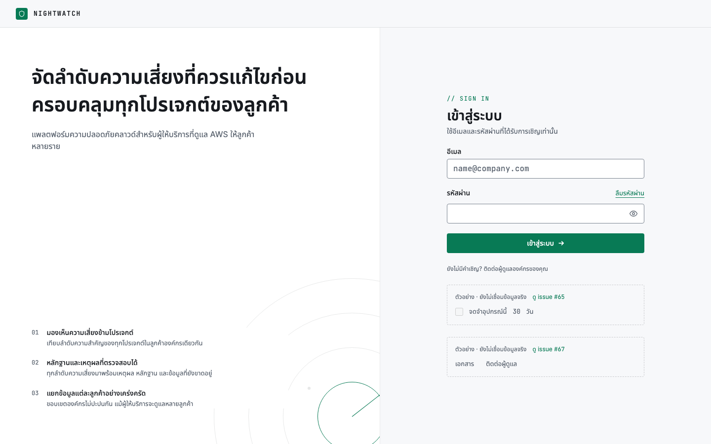
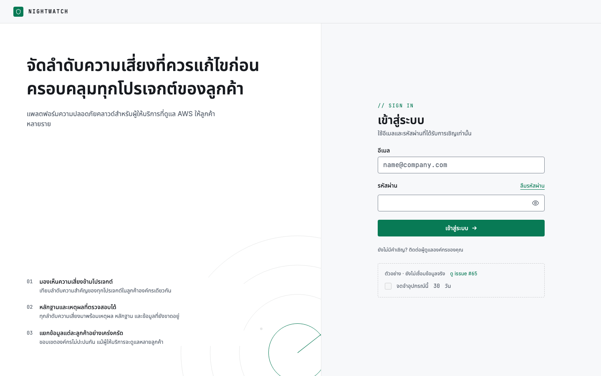
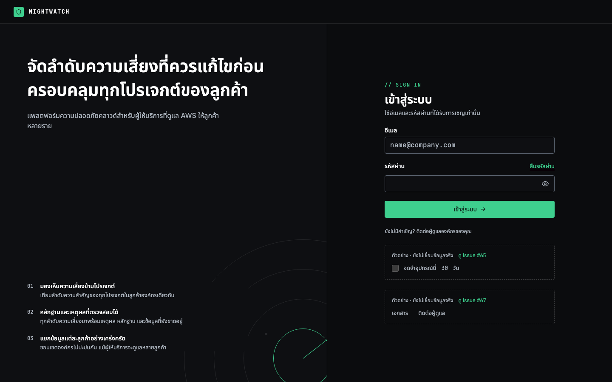

# Issue #67: Login help-link mockup removal

Desktop evidence for [PR #70](https://github.com/nixbpe/new-nightwatch/pull/70), captured in Chromium at 1440×900 with local fonts loaded and an anonymous session against the worktree's local API.

Before uses `LoginPage.tsx` from `71b2532e011227f5051d66ae2d6e0ed8498efb25` (the PR base), supplied through a temporary Vite transform. After uses the PR's unchanged application source from `6b2767e344ed44347e13fdc67048800713c1af11`. Capture tooling did not change tracked application files or mock API responses.

| Theme | Before | After |
| ----- | ------ | ----- |
| Light |  |  |
| Dark |  |  |

Browser checks observed one help-link example before and none after in each theme. The remember-device example remained present in all four captures. The invitation guidance, sign-in form and password-reset link remain visible after removal.
